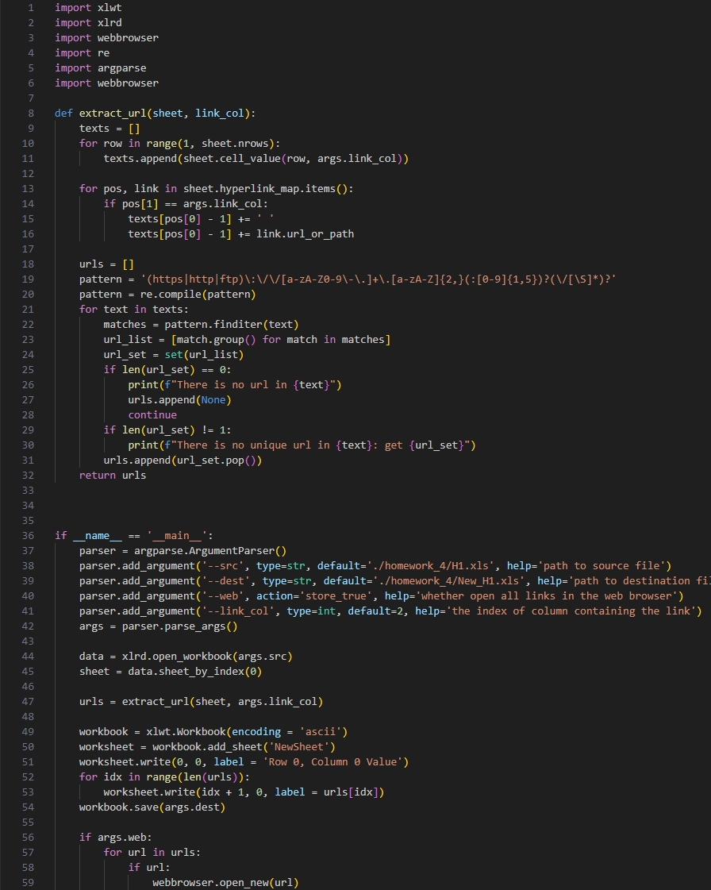
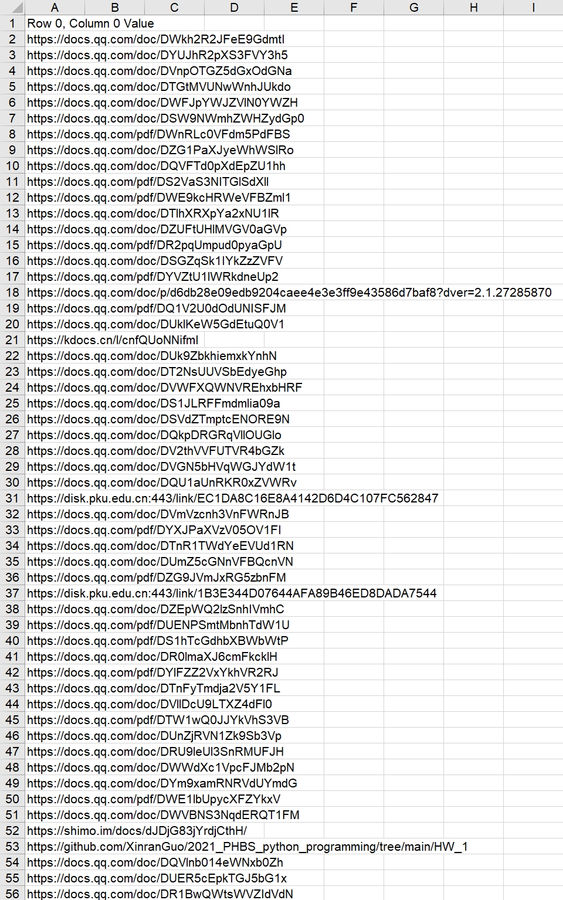
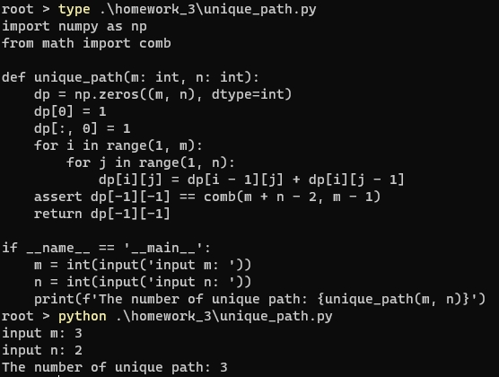
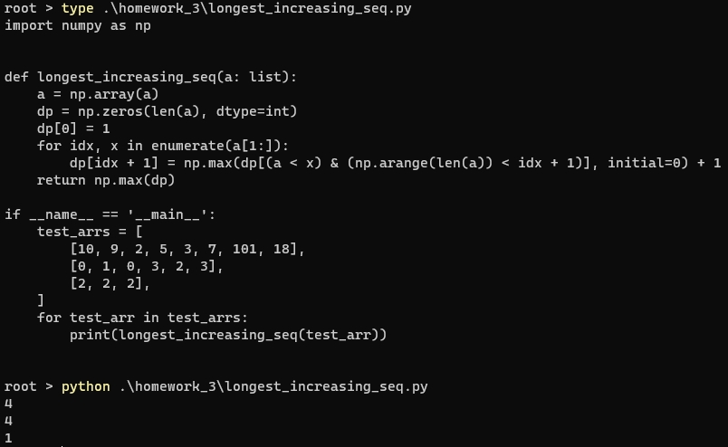
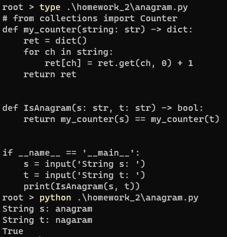
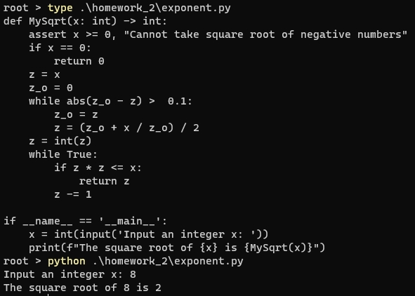
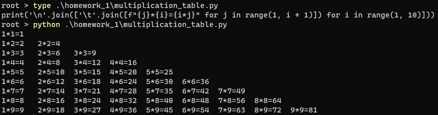

# course-python-basic
Homework for Python (basic) in PHBS

### Environment

python=3.9.13

numpy=1.24.3

xlrd=2.0.1

xlwt=1.3.0

### Homework 4

Requirement: Given H1.xls, extract all the hyperlinks into one column in New_H1.xls.

Code: `./Homework_4/extract_url.py`.

Usage: 

`--src`', path to source file, default './homework_4/H1.xls'.

`--dest`, path to destination file, default './homework_4/New_H1.xls'.

`--web`, whether open all links in the web browser.

`--link_col`, the index of column containing the link, default is 2.

Example: `./Homework_4/extract_url.py --src ./homework_4/H1.xls --dest ./homework_4/New_H1.xls --web`.

Code:

Results in `New_h1.xls`:

The New_h1.xls is not uploaded due to privacy.

### Homework 3

#### The number of unique paths 

Requirement: Arobot is located at the top-left corner of a m x n grid (marked 'Start' in the diagram below).The robot can only move ither down or right at any point in time. The robot is trying to reachthe bottom-right corner of the grid (marked Finish' in the diagram below).
How many possible unique paths are there?

Code: `./homework_3/unique_path.py`.

#### Longest increasing sequence

Requirement: Given an integer array nums, retum the length of the longest strictly increasing subsequence.

Code: `./homework_3/longest_increasing_seq.py`.

### Homework 2

#### Anagram

Requirement: Given two strings s and t, return true if t is an anagram of s, and false otherwise.

Code: `./homework_2/anagram.py`.

#### Exponent

Requirement: Given a non-negative integer x, compute and return the square root of x. The decimal digits are truncated, and only the integer part of the result is returned.

Code: `./homework_2/exponent.py`.

### Homework 1

Requirement: Write Python code to output the 9*9 multiplication table in the format shown below.

1\*1=1

...

1\*9=9   ... 9\*9=81

Code: `./homework_1/multiplication_table.py`.

