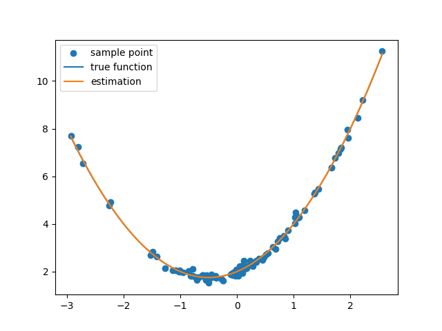

# course-python-basic
Homework for Python (basic) in PHBS.

Stu Num: 2101111265.

### Environment

python=3.9.13

numpy=1.24.3

xlrd=2.0.1

xlwt=1.3.0

beautifulsoup4=4.12.2

pypdf4=1.27.0

matplotlib=3.8.2

### Homework 6

#### Fit a Quadratic Function

Requirement: Given a set of blue points, calculate the parameters of the fitted quadratic curve using gradient descent method.

Code: `/Homework_6/quadratic_fit.py`. [link](/Homework_6/quadratic_fit.py)

```python
import numpy as np
import matplotlib.pyplot as plt
from tqdm import tqdm

def quadratic_func(x, w):
    return np.vstack((np.ones(x.shape), x, x * x)).T @ w

def quadratic_grad(x, y, w):
    basis = np.vstack((np.ones(x.shape), x, x * x)).T
    return np.average((basis @ w - y).T * basis.T, axis=1) * 2

if __name__ == '__main__':
    sample_size = 100
    lr = 0.01
    iter_num = 1000
    w = np.zeros(3)
    w_true = np.array([2, 1, 1])
    x = np.random.normal(0, 1, sample_size)
    y = quadratic_func(x, w_true) + np.random.normal(0, 0.1, sample_size)
    for iter in tqdm(range(iter_num)):
        grad = quadratic_grad(x, y, w)
        w = w - lr * grad

    grid = np.linspace(np.min(x), np.max(x), 100)
    plt.scatter(x, y, label='sample point')
    plt.plot(grid, quadratic_func(grid, w_true), label='true function')
    plt.plot(grid, quadratic_func(grid, w), label='estimation')
    plt.legend()
    plt.savefig('./figures/quadratic_fit.png')
    plt.show()
```

Results:



### Homework 5

#### Extract PDF Cover

Requirement: Given a directory of PDF files, extract the first page of all pdfs, and merge them into one pdf file.

Code: `./Homework_5/extract_cover.py`. [link](Homework_5/extract_cover.py)

```python
import os
import argparse
from PyPDF4 import PdfFileReader, PdfFileWriter


if __name__ == '__main__':
    parser = argparse.ArgumentParser()
    parser.add_argument('--src', type=str, default='./homework_5/mypdfs', help='path to source file')
    parser.add_argument('--dest', type=str, default='./homework_5/new.pdf', help='path to destination file')
    args = parser.parse_args()

    if not os.path.exists(args.src):
        raise FileNotFoundError(args.src)
    files = [f for f in os.listdir(args.src) if '.pdf' in f]
    
    writer = PdfFileWriter()
    handles = []
    for f in files:
        handle = open(os.path.join(args.src, f), "rb")
        pdf = PdfFileReader(handle)
        handles.append(handle)
        page = pdf.getPage(0)
        writer.addPage(page)

    with open(args.dest, 'wb+') as output:
        writer.write(output)

    for handle in handles:
        handle.close()
```

Usage: 

`--src`', path to source file, default './homework_5/mypdfs'.

`--dest`, path to destination file, default './homework_5/new.pdf'.

Example: `./Homework_5/extract_cover.py --src ./homework_5/mypdfs --dest ./homework_5/new.pdf`.

Results: `./Homework_5/new.pdf`. [link](Homework_5/new.pdf) (too lenthy to display here).

#### Web Crawl and Translation

Requirement: take the abstracts of the first 20 papers in the given URL, translate them into Chinese, and write them into the file.

Code: `./Homework_5/translate_abstract.py`. [link](Homework_5/translate_abstract.py)

Main code (other functions are the same as these in class):
```python
import requests
from bs4 import BeautifulSoup
import re
import random
from hashlib import md5
import os
import argparse
import time

def fromtxt(path):
    with open(path, 'r') as f:
        lines = f.readlines()
    lines = [l.strip('\n') for l in lines]
    return lines[::3], lines[1::3]

if __name__ == '__main__':
    parser = argparse.ArgumentParser()
    parser.add_argument('--en_path', type=str, default='./homework_5/abstract.txt', help='path to English abstract')
    parser.add_argument('--cn_path', type=str, default='./homework_5/my_abstract.txt', help='path to Chinese abstract')
    parser.add_argument('--appid', type=str, help='appid of Baidu translation')
    parser.add_argument('--appkey', type=str, default=2, help='appkey of Baidu translation')
    args = parser.parse_args()
    web = "https://openaccess.thecvf.com/ICCV2021?day=2021-10-12"
    if os.path.exists(args.en_path):
        name, abstracts = fromtxt(args.en_path)
    else:
        name,pdfurls = getUrl(web)
        abstracts = getAbstract(pdfurls)
        write2txt(args.en_path, name, abstracts)
    ch_abstracts = []
    for ab in abstracts:
        ch_abstracts.append(translate_api(ab, args.appid, args.appkey))
        write2txt(args.cn_path, name, ch_abstracts)
        time.sleep(10)
```

Usage: 

`--en_path`', path to English abstract, default './homework_5/abstract.txt'.

`--cn_path`, path to Chinese abstract, default './homework_5/my_abstract.txt'.

`--appid`, appid of Baidu translation.

`--appkey`, appkey of Baidu translation.

Example: `./Homework_5/translate_abstract.py --appid YOUR_APPID --appkey YOUR_APPKEY`.

Results: `./Homework_5/my_abstract.txt`. [link](Homework_5/my_abstract.txt) (too lenthy to display here).

Sample:

```
Jang C2N Practical Generative Noise Modeling for Real-World Denoising
基于学习的图像去噪方法已经局限于这样的情况，即给出了对齐良好的有噪声和干净的图像，或者从预定的噪声模型（例如，高斯）合成样本。尽管最近的生成噪声建模方法旨在模拟真实世界噪声的未知分布，但仍存在一些局限性。在实际场景中，噪声生成器应该学会在不使用成对的噪声和干净图像的情况下模拟一般和复杂的噪声分布。然而，由于现有的方法是基于对真实世界噪声的不切实际的假设构建的，它们往往会生成令人难以置信的模式，并且无法表达复杂的噪声图。因此，我们引入了一种干净到噪声的图像生成框架，即C2N，以在不使用任何配对示例的情况下模拟复杂的真实世界噪声。我们在C2N中相应地构建了具有真实世界噪声特性的每个分量的噪声生成器，以准确地表达宽范围的噪声。综合智慧
```

### Homework 4

Requirement: Given H1.xls, extract all the hyperlinks into one column in New_H1.xls.

Code: `./Homework_4/extract_url.py`.

Usage: 

`--src`', path to source file, default './homework_4/H1.xls'.

`--dest`, path to destination file, default './homework_4/New_H1.xls'.

`--web`, whether open all links in the web browser.

`--link_col`, the index of column containing the link, default is 2.

Example: `./Homework_4/extract_url.py --src ./homework_4/H1.xls --dest ./homework_4/New_H1.xls --web`.

Code:


Results in `New_h1.xls`:


The New_h1.xls is not uploaded due to privacy.

### Homework 3

#### The number of unique paths 

Requirement: Arobot is located at the top-left corner of a m x n grid (marked 'Start' in the diagram below).The robot can only move ither down or right at any point in time. The robot is trying to reachthe bottom-right corner of the grid (marked Finish' in the diagram below).
How many possible unique paths are there?

Code: `./homework_3/unique_path.py`.


#### Longest increasing sequence

Requirement: Given an integer array nums, retum the length of the longest strictly increasing subsequence.

Code: `./homework_3/longest_increasing_seq.py`.


### Homework 2

#### Anagram

Requirement: Given two strings s and t, return true if t is an anagram of s, and false otherwise.

Code: `./homework_2/anagram.py`.


#### Exponent

Requirement: Given a non-negative integer x, compute and return the square root of x. The decimal digits are truncated, and only the integer part of the result is returned.

Code: `./homework_2/exponent.py`.


### Homework 1

Requirement: Write Python code to output the 9*9 multiplication table in the format shown below.

1\*1=1

...

1\*9=9   ... 9\*9=81

Code: `./homework_1/multiplication_table.py`.


